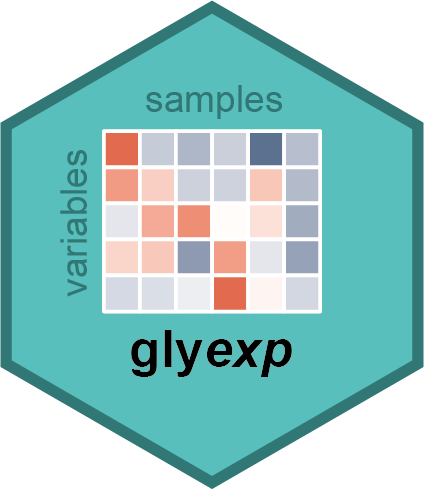

<!-- README.md is generated from README.Rmd. Please edit that file -->

```{r, include = FALSE}
knitr::opts_chunk$set(
  collapse = TRUE,
  comment = "#>",
  fig.path = "man/figures/README-",
  out.width = "100%"
)
```

# glyexp <a href="https://glycoverse.github.io/glyexp/"></a>

<!-- badges: start -->
[](https://lifecycle.r-lib.org/articles/stages.html#experimental)
[](https://CRAN.R-project.org/package=glyexp)
[](https://github.com/glycoverse/glyexp/actions/workflows/R-CMD-check.yaml)
[](https://app.codecov.io/gh/glycoverse/glyexp)
<!-- badges: end -->

The goal of glyexp is to manage data in glycoproteomics and glycomics experiments
in a tidy way.

## Installation

You can install the development version of glyexp from [GitHub](https://github.com/) with:

``` r
# install.packages("pak")
pak::pak("glycoverse/glyexp")
```

## Example

```{r}
library(glyexp)
library(magrittr)

# Create a toy experiment
a_little_toy <- toy_experiment()
a_little_toy
```

```{r}
get_expr_mat(a_little_toy)
```

```{r}
get_sample_info(a_little_toy)
```

```{r}
get_var_info(a_little_toy)
```

```{r}
# Filter samples
a_little_toy %>% 
  filter_samples(group == "A") %>% 
  filter_variables(protein == "PRO1")
```
