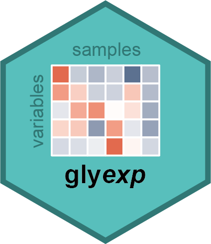

<!-- README.md is generated from README.Rmd. Please edit that file -->

```{r, include = FALSE}
knitr::opts_chunk$set(
  collapse = TRUE,
  comment = "#>",
  fig.path = "man/figures/README-",
  out.width = "100%"
)
```

# glyexp <a href="https://glycoverse.github.io/glyexp/"></a>

<!-- badges: start -->
[](https://lifecycle.r-lib.org/articles/stages.html#experimental)
[](https://CRAN.R-project.org/package=glyexp)
[](https://glycoverse.r-universe.dev/glyexp)
[](https://github.com/glycoverse/glyexp/actions/workflows/R-CMD-check.yaml)
[](https://app.codecov.io/gh/glycoverse/glyexp)
<!-- badges: end -->

Provides a tidy data framework for managing glycoproteomics and glycomics experimental data.
The core feature is the 'experiment()' class,
which serves as a unified data container integrating expression matrices,
variable information (proteins, peptides, glycan compositions, etc.),
and sample metadata (groups, batches, clinical variables, etc.).
The package enforces data consistency, validates column types according to experiment types
(glycomics, glycoproteomics, traitomics, traitproteomics),
and provides dplyr-style data manipulation functions (filter, mutate, select, arrange, slice, join)
for seamless data wrangling.

## Installation

### Install glycoverse

We recommend installing the meta-package [glycoverse](https://github.com/glycoverse/glycoverse),
which includes this package and other core glycoverse packages.

### Install glyexp alone

If you don't want to install all glycoverse packages, you can only install glyexp.

You can install the latest release of glyexp from [r-universe](https://glycoverse.r-universe.dev/glyexp) (**recommended**):

```r
# install.packages("pak")
pak::repo_add(glycoverse = "https://glycoverse.r-universe.dev")
pak::pkg_install("glyexp")
```

Or from [GitHub](https://github.com/glycoverse/glyexp):

``` r
pak::pkg_install("glycoverse/glyexp@*release")
```

Or install the development version (NOT recommended):

``` r
pak::pkg_install("glycoverse/glyexp")
```

**Note:** Tips and troubleshooting for the meta-package [glycoverse](https://github.com/glycoverse/glycoverse)
are also applicable here: [Installation of glycoverse](https://github.com/glycoverse/glycoverse#installation).

## Documentation

- 🚀 Get started: [Here](https://glycoverse.github.io/glyexp/articles/glyexp.html)
- 🔧 dplyr-style data manipulation: [Here](https://glycoverse.github.io/glyexp/articles/dplyr-style-functions.html)
- 📚 Reference: [Here](https://glycoverse.github.io/glyexp/reference/index.html)

## Role in `glycoverse`

The `experiment()` class provides a consistent interface for glycoprotemics and glycomics data.
All other packages in the `glycoverse` ecosystem know how to extract information from an `experiment()` object.
So, put your data in an `experiment()` object and pass it around.
Let other packages do the heavy lifting.

## Example

```{r}
library(glyexp)
library(magrittr)

# Create a toy experiment
a_little_toy <- toy_experiment
a_little_toy
```

```{r}
get_expr_mat(a_little_toy)
```

```{r}
get_sample_info(a_little_toy)
```

```{r}
get_var_info(a_little_toy)
```

```{r}
# Filter samples
a_little_toy %>% 
  filter_obs(group == "A") %>%
  filter_var(protein == "PRO1")
```
