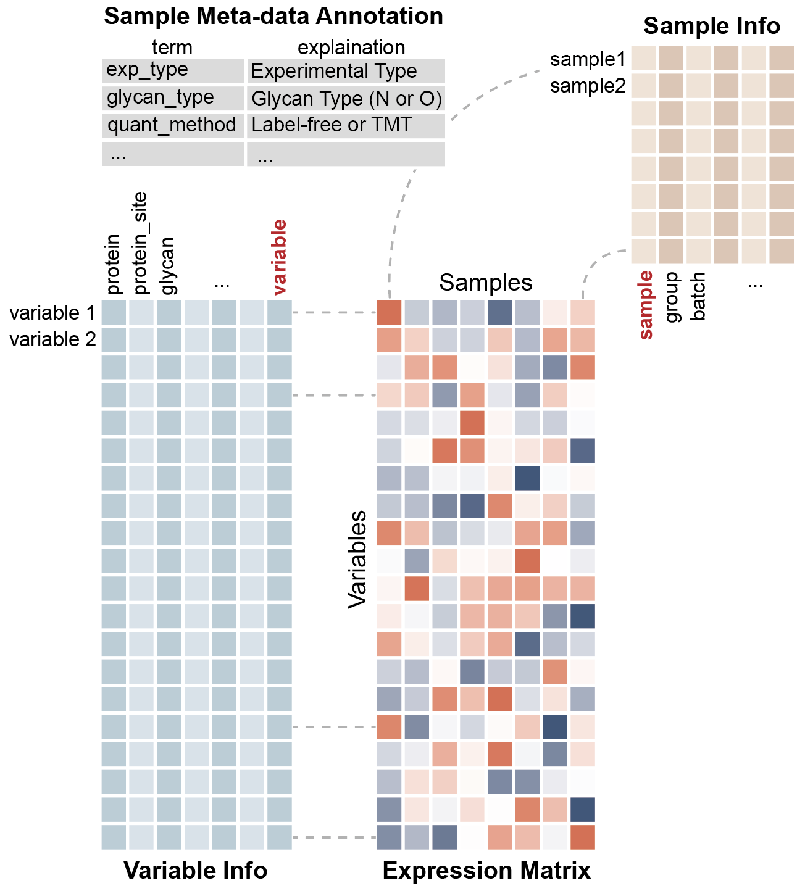

```{r, include = FALSE}
knitr::opts_chunk$set(
  collapse = TRUE,
  comment = "#>"
)
```

Picture this: you're knee-deep in omics experiments (especially the fascinating world of glycomics and glycoproteomics), 
and you're juggling three types of data like a lab virtuoso:

1. **Expression data** - the actual measurements of your biological molecules (glycans, 
   glycopeptides, 
   and their friends)
2. **Molecular annotations** - the ID cards for your molecules (structures, 
   sequences, 
   you name it)
3. **Experimental metadata** - the story behind your samples (time points, 
   treatments, 
   experimental conditions)

Here's where `glyexp` swoops in to save the day! 🦸‍♀️

The `experiment()` class is your new best friend - think of it as a smart container that keeps all three data types organized and talking to each other. 
No more scattered spreadsheets or lost annotations!

**Why should you care?** Every package in the `glycoverse` ecosystem speaks `experiment()` fluently. 
It's like having a universal translator for your glycomics workflow - everything just *clicks* together.

```{r setup}
library(glyexp)
library(dplyr)
library(conflicted)

# Resolve function conflicts - prefer glyexp version over deprecated dplyr version
# `dplyr::select_var` is deprecated anyway, so we can safely override it
conflicts_prefer(glyexp::select_var)
```

## Your First Steps into the Glycoverse

Let's dive in with our trusty toy experiment - think of it as your training wheels before you tackle the real deal.

```{r}
toy_exp <- toy_experiment
toy_exp
```

Look at that beautiful summary! 
When you print an `experiment()` object, 
it's like getting a snapshot of your entire experimental world - variables, observations, 
and all the metadata that makes your data meaningful.

Now, let's peek under the hood. You can extract the three core components faster than you can say "glycosylation":

### 🧬 The Expression Matrix - Your Data's Heart and Soul

```{r}
get_expr_mat(toy_exp)
```

This matrix is where the magic happens - rows are your variables (molecules), 
columns are your observations (samples), 
and the numbers tell your biological story.

### 🏷️ Variable Information - Meet Your Molecules

```{r}
get_var_info(toy_exp)
```

Think of this as your molecular address book - every variable gets its own detailed profile.

### 📋 Sample Information - Know Your Experiments

```{r}
get_sample_info(toy_exp)
```

And this? 
This is your experimental diary - tracking every condition, timepoint, and treatment.

**Here's the cool part:** Notice how the "variable" column in `get_var_info()` and the "sample" column in `get_sample_info()` perfectly match the row and column names in your expression matrix? 
That's no accident!

These are the **index columns** - the secret sauce that keeps everything synchronized. 
They're like the GPS coordinates that ensure your data stays connected no matter what transformations you throw at it.

## Data Wrangling Made Easy - dplyr Meets glyexp

If you've ever used `dplyr` (and who hasn't?), you're already 90% of the way there! 🎉

For every `dplyr` function you know and love, 
`glyexp` gives you two specialized versions:

- **`_obs()`** functions: work on your sample metadata
- **`_var()`** functions: work on your variable annotations

Let's see this in action. Want to focus on just group "A" samples?

```{r}
subset_exp <- filter_obs(toy_exp, group == "A")
```

Let's check what happened to our sample info:

```{r}
get_sample_info(subset_exp)
```

Beautiful! But here's where the magic really shines - check out the expression matrix:

```{r}
get_expr_mat(subset_exp)
```

🎪 **Ta-da!** The expression matrix automatically filtered itself to match! 
It's like having a well-trained assistant who anticipates your every move.

This is `filter_obs()` in a nutshell: 
"Hey, filter my sample info this way, and oh yeah, make sure everything else follows suit." 
And it does, flawlessly.

Variable filtering works the same way:

```{r}
toy_exp |>
  filter_obs(group == "A") |>
  filter_var(glycan_composition == "H5N2") |>
  get_expr_mat()
```

Notice how these functions support the pipe operator (`|>`)? 
That's the `dplyr` DNA in action!

The pattern is simple: `glyexp` functions are just like their `dplyr` cousins, 
but with two superpowers:

1. They expect and return `experiment()` objects (keeping your data ecosystem intact)
2. They treat those index columns like precious cargo (no accidental deletions here!)

## Complete dplyr Function Reference

Here's your complete toolkit of supported dplyr-style functions. **These functions orchestrate seamless coordination between all three data types** - expression matrix, sample information, and variable information - ensuring everything stays perfectly synchronized:

| dplyr Function | For Samples (`_obs`) | For Variables (`_var`) | What It Does |
|:---|:---|:---|:---|
| `filter()` | `filter_obs()` | `filter_var()` | Subset rows based on conditions |
| `select()` | `select_obs()` | `select_var()` | Choose specific columns |
| `arrange()` | `arrange_obs()` | `arrange_var()` | Reorder rows by column values |
| `mutate()` | `mutate_obs()` | `mutate_var()` | Create/modify columns |
| `rename()` | `rename_obs()` | `rename_var()` | Rename columns |
| `slice()` | `slice_obs()` | `slice_var()` | Select rows by position |
| `slice_head()` | `slice_head_obs()` | `slice_head_var()` | Select first n rows |
| `slice_tail()` | `slice_tail_obs()` | `slice_tail_var()` | Select last n rows |
| `slice_sample()` | `slice_sample_obs()` | `slice_sample_var()` | Select random rows |
| `slice_max()` | `slice_max_obs()` | `slice_max_var()` | Select rows with highest values |
| `slice_min()` | `slice_min_obs()` | `slice_min_var()` | Select rows with lowest values |
| `left_join()` | `left_join_obs()` | `left_join_var()` | Add new columns from another table (left join) |
| `inner_join()` | `inner_join_obs()` | `inner_join_var()` | Add new columns from another table (inner join) |
| `semi_join()` | `semi_join_obs()` | `semi_join_var()` | Filter rows from another table (semi join) |
| `anti_join()` | `anti_join_obs()` | `anti_join_var()` | Filter rows from another table (anti join) |

**The magic ingredient?** Every single one of these functions automatically updates the expression matrix to match your metadata operations. 
Filter out half your samples? 
The matrix follows suit. 
Rearrange your variables? 
The matrix dances to the same tune.

**What about other `dplyr` functions?** For functions not directly supported (like `distinct()`, `pull()`, `count()`, etc.), 
simply extract the tibble first and go wild:

```{r eval=FALSE}
# Extract the tibble, then use any dplyr function you want
toy_exp |>
  get_sample_info() |>
  distinct(group)

toy_exp |>
  get_var_info() |>
  pull(protein) |>
  unique()

toy_exp |>
  get_sample_info() |>
  count(group)
```

## The Sacred Index Columns - Handle with Care

Remember those index columns we mentioned? 
Here's the golden rule: **Don't mess with them directly!** 
The reason is simple: `glyexp` relies on them to synchronize expression matrix, sample info, and variable info.
Look at this picture to understand it better:



Think of them as the foundation of your data house - you can redecorate all you want, 
but don't touch the support beams.

Want to select specific columns from your sample info? Easy:

```{r}
toy_exp |>
  select_obs(group) |>
  get_sample_info()
```

See how the "sample" column (our trusty index) stuck around? 
That's `glyexp` being protective of your data integrity.

Even when you try to be sneaky, it's got your back:

```{r}
toy_exp |>
  select_obs(-starts_with("sample")) |>
  get_sample_info()
```

Nice try, but that index column isn't going anywhere! 😄

## Slicing and Dicing - Matrix-Style Subsetting

Want to subset your experiment? 
Think matrix indexing, but smarter:

```{r}
subset_exp <- toy_exp[, 1:3]
```

This grabs the first 3 samples, and like a good butler, 
updates everything else accordingly:

```{r}
get_expr_mat(subset_exp)
```

```{r}
get_sample_info(subset_exp)
```

Both the expression matrix and sample info are perfectly in sync. It's like they're dancing to the same tune!

## Merging and Splitting - The Dynamic Duo

Imagine this: you run your favorite glycopeptide identification software two times on two batches,
and you use `glyread` to load the results into two [experiment()]s.
How do you combine them into a single [experiment()]?
The answer is `merge()`:

```R
merge(exp1, exp2)
```

What it does is quite complex, but you can rely on `merge()` to handle it for you.
If you want to keep the batch information, you can use `mutate_obs()` to add an ID column before merging.

What if you have more than one experiment to merge?
Put them in a list and use `purrr::reduce()` to merge them:

```R
purrr::reduce(list(exp1, exp2, exp3), merge)
```

The opposite of `merge()` is `split()`, which splits an [experiment()] into a list of [experiment()]s.
You can provide a column to split by, and the unique values of that column will be used as the names of the list.

```{r}
split(toy_exp, group, where = "sample_info")
```

Now the "A" experiment only contains samples from group "A", and "B" experiment from group "B".

## When You Need to Break Free - The Tibble Escape Hatch

The `glycoverse` ecosystem is pretty comprehensive, 
but we know there are times when you need to venture beyond our cozy world. 
When that moment comes,
you can always fall back to basic R data structures by `get_expr_mat()`, `get_sample_info()`, and `get_var_info()`.

Alternatively, use `as_tibble()` to convert your `experiment()` to a tibble in
[tidy-format](https://r4ds.hadley.nz/data-tidy.html#sec-tidy-data):

```{r}
as_tibble(toy_exp)
```

**Pro tip:** These tibbles can get *really* long (think novel-length), 
especially with all that rich metadata. 
Smart analysts filter their experiments first:

```{r}
toy_exp |>
  filter_var(glycan_composition == "H5N2") |>
  select_obs(group) |>
  select_var(-glycan_composition) |>
  as_tibble()
```

Much more manageable, right?

## Standing on the Shoulders of Giants

Designing `experiment()` wasn't done in a vacuum - we learned from some amazing predecessors:

**SummarizedExperiment** 📊  
The granddaddy of omics data containers from [Bioconductor](https://github.com/Bioconductor/SummarizedExperiment). 
Solid as a rock for RNA-seq, 
but not quite "tidy" enough for our taste.

**tidySummarizedExperiment** 🧹  
A brilliant attempt to bring tidy principles to SummarizedExperiment from the [tidySummarizedExperiment](https://github.com/tidyomics/tidySummarizedExperiment) package. 
We love the concept, 
but felt that cramming everything into one tibble doesn't quite capture the mental model of separated data types.

**massdataset** 🔬  
Our closest cousin! 
The [massdataset](https://github.com/tidymass/massdataset) package gets so many things right - 
tidy operations, clean data separation, perfect for mass spec data. 
We especially admire its data processing history tracking (reproducibility FTW!). 

But here's our twist: while object-oriented programming has its merits, 
we believe most R users think functionally. 
Your code *is* your reproducibility trail - elegant, transparent, and familiar to every R user.

**Our Philosophy** 💭  
We chose the functional programming path because it feels like home to R users. 
No hidden states, no mysterious transformations - 
just clear, chainable functions that do exactly what they say on the tin.

---

*Huge thanks to all the developers who paved this road. `glyexp` exists because of your groundbreaking work! 🙏*

## What's Next?

Now you have the basic understanding of `experiment()`.
Next, you can learn how to use `experiment()` in your analysis.

- [Creating Experiments](https://glycoverse.github.io/glyexp/articles/create-exp.html)
- [Experiment Types](https://glycoverse.github.io/glyexp/articles/exp-type.html)
- [Dplyr-Style Functions](https://glycoverse.github.io/glyexp/articles/dplyr-style-functions.html)
