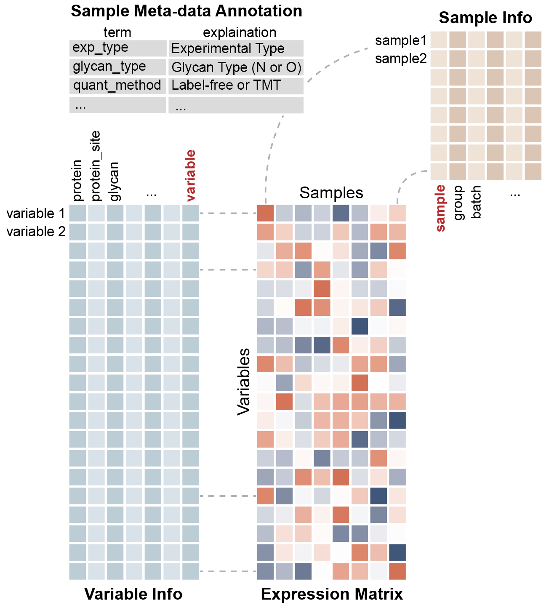

```{r, include = FALSE}
knitr::opts_chunk$set(
  collapse = TRUE,
  comment = "#>"
)
```

In this context, you typically work with three types of data in glycomics and glycoproteomics experiments:

1. **Expression data** - the actual measurements of your biological molecules (glycans, glycopeptides, etc.)
2. **Molecular annotations** - the identifiers for your molecules (structures, sequences, etc.)
3. **Experimental metadata** - the context of your samples (time points, treatments, experimental conditions)

The `experiment()` class serves as a structured container that keeps all three data types organized and interconnected.

**Why should you care?** Every package in the `glycoverse` ecosystem speaks `experiment()` fluently. 
It's like having a universal translator for your glycomics workflow - everything just *clicks* together.

```{r setup}
library(glyexp)
library(dplyr)
library(conflicted)

# Resolve function conflicts - prefer glyexp version over deprecated dplyr version
# `dplyr::select_var` is deprecated anyway, so we can safely override it
conflicts_prefer(glyexp::select_var)
```

## Getting Started with glyexp

Let's begin with a simple example to illustrate the basic concepts.

```{r}
toy_exp <- toy_experiment
toy_exp
```

The summary provides an overview of your entire experiment - variables, observations, and all the metadata.

The three core components can be extracted as follows:

### The Expression Matrix

The expression matrix contains your numerical data - rows are variables (molecules), columns are observations (samples).

```{r}
get_expr_mat(toy_exp)
```

This matrix is where the magic happens - rows are your variables (molecules), 
columns are your observations (samples), 
and the numbers tell your biological story.

### Variable Information

The variable information table contains detailed annotations for each molecule.

```{r}
get_var_info(toy_exp)
```

Think of this as your molecular address book - every variable gets its own detailed profile.

### Sample Information

The sample information table records the experimental conditions for each sample.

```{r}
get_sample_info(toy_exp)
```

And this? 
This is your experimental diary - tracking every condition, timepoint, and treatment.

Notice that the "variable" column in `get_var_info()` and the "sample" column in `get_sample_info()`
match the row and column names in your expression matrix.
These are the **index columns** that maintain synchronization between data components.

## Data Manipulation with glyexp

glyexp provides dplyr-style functions for manipulating experiment objects.

For every dplyr function, glyexp provides two specialized versions:

- **`_obs()`** functions: work on your sample metadata
- **`_var()`** functions: work on your variable annotations

Here's an example of filtering for group "A" samples:

```{r}
subset_exp <- filter_obs(toy_exp, group == "A")
```

Let's check what happened to our sample info:

```{r}
get_sample_info(subset_exp)
```

Check the expression matrix:

```{r}
get_expr_mat(subset_exp)
```

The expression matrix is automatically filtered to match!

This is `filter_obs()`: it filters the sample information and automatically updates the expression matrix to match.

Variable filtering works the same way:

```{r}
toy_exp |>
  filter_obs(group == "A") |>
  filter_var(glycan_composition == "H5N2") |>
  get_expr_mat()
```

Notice how these functions support the pipe operator (`|>`)? 
That's the `dplyr` DNA in action!

The pattern is straightforward: glyexp functions expect and return `experiment()` objects,
and they preserve the index columns during operations.

## Complete dplyr Function Reference

The following table lists all supported dplyr-style functions.
These functions maintain synchronization between the expression matrix, sample information, and variable information:

| dplyr Function | For Samples (`_obs`) | For Variables (`_var`) | What It Does |
|:---|:---|:---|:---|
| `filter()` | `filter_obs()` | `filter_var()` | Subset rows based on conditions |
| `select()` | `select_obs()` | `select_var()` | Choose specific columns |
| `arrange()` | `arrange_obs()` | `arrange_var()` | Reorder rows by column values |
| `mutate()` | `mutate_obs()` | `mutate_var()` | Create/modify columns |
| `rename()` | `rename_obs()` | `rename_var()` | Rename columns |
| `slice()` | `slice_obs()` | `slice_var()` | Select rows by position |
| `slice_head()` | `slice_head_obs()` | `slice_head_var()` | Select first n rows |
| `slice_tail()` | `slice_tail_obs()` | `slice_tail_var()` | Select last n rows |
| `slice_sample()` | `slice_sample_obs()` | `slice_sample_var()` | Select random rows |
| `slice_max()` | `slice_max_obs()` | `slice_max_var()` | Select rows with highest values |
| `slice_min()` | `slice_min_obs()` | `slice_min_var()` | Select rows with lowest values |
| `left_join()` | `left_join_obs()` | `left_join_var()` | Add new columns from another table (left join) |
| `inner_join()` | `inner_join_obs()` | `inner_join_var()` | Add new columns from another table (inner join) |
| `semi_join()` | `semi_join_obs()` | `semi_join_var()` | Filter rows from another table (semi join) |
| `anti_join()` | `anti_join_obs()` | `anti_join_var()` | Filter rows from another table (anti join) |

Each function automatically updates the expression matrix when you modify metadata.
Filter samples, and the matrix follows. Rearrange variables, and the matrix adjusts accordingly.

For functions not directly supported (like `distinct()`, `pull()`, `count()`, etc.), extract the tibble first:

```{r eval=FALSE}
# Extract the tibble, then use any dplyr function you want
toy_exp |>
  get_sample_info() |>
  distinct(group)

toy_exp |>
  get_var_info() |>
  pull(protein) |>
  unique()

toy_exp |>
  get_sample_info() |>
  count(group)
```

## Index Columns

As mentioned, the index columns maintain synchronization between data components.
Avoid modifying these columns directly, as glyexp relies on them to keep everything connected.



The index columns are essential for data integrity - they can be renamed but not removed.

Want to select specific columns from your sample info? Easy:

```{r}
toy_exp |>
  select_obs(group) |>
  get_sample_info()
```

The "sample" column remains protected:

The index column cannot be removed:

## Matrix-Style Subsetting

Experiments can be subset using matrix-style indexing:

```{r}
subset_exp <- toy_exp[, 1:3]
```

This selects the first 3 samples and updates all components accordingly:

```{r}
get_expr_mat(subset_exp)
```

```{r}
get_sample_info(subset_exp)
```

Both the expression matrix and sample info are synchronized.

## Merging and Splitting

Experiments can be merged or split:

```R
merge(exp1, exp2)
```

The `merge()` function combines two experiments.
If you need to preserve batch information, use `mutate_obs()` to add an ID column before merging.

What if you have more than one experiment to merge?
Put them in a list and use `purrr::reduce()` to merge them:

```R
purrr::reduce(list(exp1, exp2, exp3), merge)
```

The `split()` function divides an experiment into a list of experiments based on a column:

```{r}
split(toy_exp, group, where = "sample_info")
```

Now the "A" experiment only contains samples from group "A", and "B" experiment from group "B".

## Converting to Tibbles

For operations beyond what glyexp provides, you can extract the individual components:

Alternatively, use `as_tibble()` to convert your experiment to a tibble in tidy format:

```{r}
as_tibble(toy_exp)
```

These tibbles can be large, so filtering first is recommended:

```{r}
toy_exp |>
  filter_var(glycan_composition == "H5N2") |>
  select_obs(group) |>
  select_var(-glycan_composition) |>
  as_tibble()
```

Much more manageable, right?

## Background and Design Principles

The `experiment()` class was designed with insights from related data containers:

**SummarizedExperiment**
The foundational omics data container from Bioconductor. Well-established for RNA-seq analysis.

**tidySummarizedExperiment**
An attempt to bring tidy principles to SummarizedExperiment from the tidySummarizedExperiment package.
While the concept is sound, storing all components in a single tibble doesn't align
with the mental model of separated data types.

**massdataset**
A related package for mass spectrometry data.
It provides tidy operations, clean data separation, and data processing history tracking.
We appreciate its approach to reproducibility.

While object-oriented programming has its merits, glyexp takes a functional programming approach.
Your analysis code serves as the reproducibility record - clear, transparent, and familiar to R users.

**Design Philosophy**
glyexp uses functional programming because it aligns with how R users work.
The design emphasizes clear, chainable functions.

Thank you to all the developers who contributed to these foundational packages.

## What's Next?

Now you have the basic understanding of `experiment()`.
Next, you can learn how to use `experiment()` in your analysis.

- [Creating Experiments](https://glycoverse.github.io/glyexp/articles/create-exp.html)
- [Experiment Types](https://glycoverse.github.io/glyexp/articles/exp-type.html)
- [Dplyr-Style Functions](https://glycoverse.github.io/glyexp/articles/dplyr-style-functions.html)
